<div align="center">



<a href="https://git.io/typing-svg">
  
</a>

<br/><br/>


</div>

---

## What is NullTrace?

**NullTrace** is a Python 3 web recon and intelligence toolkit for authorized penetration testers and bug bounty hunters. It provides port scanning, CMS detection, WordPress recon, server-wide site enumeration, Cloudflare bypass checking, and SQL error detection — all from a clean terminal interface with zero external dependencies.

Rebuilt from `hacktronian` by **[krypthane](https://github.com/wavegxz-design)** — Red Team Operator from Mexico.

---

## Modules

```
+-------------------------------+----------------------------------+
|  NullTrace  v1.0  Module Map                                    |
+-------------------------------+----------------------------------+
|  INFORMATION GATHERING        |  WEB RECON                       |
|  [1] Host to IP               |  [1] WP & Joomla Scanner         |
|  [2] Port Scanner             |  [2] WP Plugin Scanner (file)    |
|  [3] Server Banner Grab       |  [3] WP Vulnerability Check      |
|  [4] CMS Detection            |  [4] Gravity Forms Finder        |
|  [5] WordPress User Enum      |                                  |
+-------------------------------+----------------------------------+
|  SERVER RECON (IP-based)                                        |
|  Get all sites · WP/Joomla detect · Admin panel finder          |
|  Backup file scan · Port scan · SQL error probe                 |
|  Server banner · Cloudflare bypass check                        |
+-------------------------------+----------------------------------+
```

---

## Bug Fixes v1.0

> Full audit by **krypthane** — migrated Python 2 → Python 3

| ID | Bug | Severity | Fix |
|----|-----|----------|-----|
| BUG-01 | Full Python 2 codebase (urllib2, raw_input, httplib, Queue) | CRITICAL | Full Python 3 migration |
| BUG-02 | `unique()` defined 3 times | HIGH | Single utility function |
| BUG-03 | `bing_all_grabber()` defined 3 times | HIGH | Single function |
| BUG-04 | `check_wordpress()` defined 2 times | HIGH | Deduplicated |
| BUG-05 | `wpsycmium.append()` — NameError (typo) | HIGH | Fixed → `wpsymposium` |
| BUG-06 | `portScanner()` outside class with `self` | HIGH | Moved inside `ServerRecon` |
| BUG-07 | `menu()` defined 2 times | HIGH | Single clean `main_menu()` |
| BUG-08 | `cmsscan()` uses `@@` instead of `&&` | MED | Fixed shell command |
| BUG-09 | `fluxion()` mixed tabs/spaces IndentationError | MED | Removed (broken) |
| BUG-10 | `os.system('clear')` called 4 times at startup | MED | Single `subprocess.run()` |
| BUG-11 | `bcolors` and `colors` classes were empty stubs | MED | Real `C` color class |
| BUG-12 | `urllib2.HTTPError, e` (Python 2 syntax) | MED | `except Exception as e` |
| BUG-13 | `except(), message:` (Python 2 syntax) | MED | `except Exception as e` |
| BUG-14 | `print` without parentheses throughout | LOW | `print()` everywhere |
| BUG-15 | No timeout on any network call | LOW | `timeout=8` on all calls |

**Also removed (malicious/unsafe — not bugs, but lammer garbage):**
- `drupal()` / `drupallist()` — sent targets to a hardcoded C2 server
- `gabriel()`, `sitechecker()`, `vbulletinrce()`, `joomlarce()` — `wget` + exec from pastebin
- `smtpsend()`, `pisher()` — downloaded and executed unknown scripts
- Webshell lists and upload finder designed to plant web shells

---

## Installation

```bash
git clone https://github.com/wavegxz-design/NullTrace
cd NullTrace
python3 nulltrace.py

# Optional: add to PATH
sudo bash install.sh
```

No `pip install` needed — pure Python 3 stdlib.

---

## Usage

```bash
python3 nulltrace.py
```

```
  NullTrace v1.0 — Web Recon & Intelligence Toolkit
  Author: krypthane | wavegxz-design

  [1] Information Gathering
  [2] Web Recon
  [3] Server Recon
  [99] Exit

  nulltrace~#
```

---

## Legal Disclaimer

```
For AUTHORIZED security research and educational purposes ONLY.

OK:  Bug bounty (in scope), CTF, authorized pentesting, personal labs
NOT OK: Unauthorized scanning, harassment, illegal activity

Author assumes NO responsibility for misuse.
```

---

## Author

| | |
|:---:|:---|
| **krypthane** | Red Team Operator · Open Source Developer |
| GitHub | [github.com/wavegxz-design](https://github.com/wavegxz-design) |
| Telegram | [t.me/Skrylakk](https://t.me/Skrylakk) |
| Email | Workernova@proton.me |
| Location | Mexico UTC-6 |

[](https://github.com/wavegxz-design)
[](https://t.me/Skrylakk)
[](mailto:Workernova@proton.me)
[](https://krypthane.workernova.workers.dev)

---

*"Know the attack to build the defense." — krypthane*
